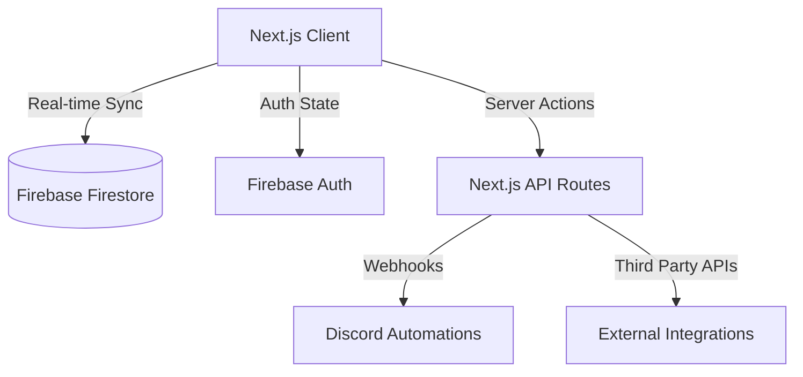

# 🏢 Mints Global ERP | Premium Command Center

Welcome to the **Mints Global ERP**, a state-of-the-art enterprise resource planning system designed to centralize and automate core business operations. Built with modern web technologies, this platform offers a sleek, high-performance interface for Human Resources, Client Relationship Management (CRM), Project Management, Financial Tracking, and Automated Workflows.


---

## 🏛️ Architecture & Flow Diagram
Mints Global ERP utilizes a secure, serverless architecture powered by Next.js and Firebase. The client communicates directly with Firestore for real-time data sync using a customized React Context provider for Authentication and state management. Server-side API routes handle secure third-party integrations, such as Discord Webhooks.



---

## 💻 Tech Stack
The Mints Global ERP is built on a modern, robust foundation to ensure performance and scalability:

- **Frontend**: Next.js 14 (App Router) + React 19 + TypeScript
- **Backend/DB**: Firebase (Cloud Firestore + Authentication)
- **Styling**: Tailwind CSS v4, Framer Motion, shadcn/ui (Radix UI)
- **Hosting**: Vercel
- **Other integrations**: Discord Webhooks API, Google Workspace (for SSO), jsPDF (for document generation)

---

## 🚀 Getting Started
This section is critical for setting up the local development environment for onboarding developers.

### Prerequisites
- **Node.js** (v18.x or higher)
- **npm** or **yarn**
- **Firebase Project** setup (Firestore, Authentication enabled)
- **Discord Server** (with Webhook integrations enabled)

### Clone the repo
```bash
git clone https://github.com/Mints-ai/ERP.git
cd ERP
```

### Install dependencies
```bash
npm install
```

### Environment variables
Create a `.env.local` file in the root directory. You must include the following keys (do not reveal actual values in source control):

```env
NEXT_PUBLIC_FIREBASE_API_KEY=""
NEXT_PUBLIC_FIREBASE_AUTH_DOMAIN=""
NEXT_PUBLIC_FIREBASE_PROJECT_ID=""
NEXT_PUBLIC_FIREBASE_STORAGE_BUCKET=""
NEXT_PUBLIC_FIREBASE_MESSAGING_SENDER_ID=""
NEXT_PUBLIC_FIREBASE_APP_ID=""
DISCORD_WEBHOOK_URL=""
```

### Run locally
```bash
npm run dev
```
The application will start at `http://localhost:3000`.

---

## 📂 Project Structure
```text
/
├── public/                 # Static assets, brand logos
├── src/
│   ├── app/                # Next.js App Router pages (Dashboard, Login, API)
│   │   ├── api/            # Serverless API routes (Discord, OCR)
│   │   ├── dashboard/      # All ERP modules (HR, Finance, Projects, CRM, etc.)
│   │   └── login/          # Authentication entry point
│   ├── components/         # Reusable UI components
│   │   ├── layout/         # Navigation, Sidebar, RoleGuard, TopNav
│   │   └── ui/             # shadcn/ui generic components
│   ├── context/            # React Context (AuthContext, ToastContext)
│   └── lib/                # Utility functions, Firebase init, Permissions
├── .env.local              # Environment variables (git-ignored)
└── tailwind.config.ts      # Tailwind CSS configuration
```

---

## ✨ Features
Mints Global ERP replaces disjointed spreadsheets and isolated SaaS tools by bringing everything under one unified roof. 

### Modules currently built:
- **Attendance tracking**: Real-time logging with Discord webhook notifications.
- **Employee management (HR Hub)**: Onboard new hires, assign multiple departments, track intern progress.
- **Leave management**: Apply for leave, view balance, and approval workflow integrated with Discord.
- **CRM & Sales Pipeline**: Visual drag-and-drop Kanban pipeline for leads.
- **Projects & Capacity Planning**: Active project scopes, team assignment, and capacity monitoring.
- **Finance & Invoicing**: Track revenue streams and generate dynamic PDF invoices/proposals.
- **Role-based access control (RBAC)**: Secure access gating based on hierarchy (Founders, C-Suite, Managers, Employees, Interns).
- **Discord Bot Integration**: Real-time push notifications for logins, logouts, and leave applications.
- **Global Command Palette**: Instantly search and navigate across the ERP (`Ctrl+K`).

---

## 🤝 Contributing Guidelines
Since this is an internal project with interns and team members, please adhere to the following workflow:

### Branch naming convention
Use standard prefixes for branch names: `type/module-name`
Examples:
- `feature/attendance-system`
- `fix/login-button`
- `docs/update-readme`

### Commit message format
We use semantic commit messages:
- `feat: add new reporting dashboard`
- `fix: resolve responsive layout on mobile`
- `chore: update dependencies`

### PR review process
1. Ensure your code builds locally (`npm run build`).
2. Open a Pull Request targeting the `master` branch.
3. Add a clear description of the changes.
4. Request a review from at least one senior developer or admin.
5. Once approved, the PR can be merged and deployed automatically via Vercel.

---

## 🗺️ Roadmap
We follow a phased development approach:

- **Phase 1: Foundation & HR (Done)** 
  - User Authentication, RBAC, HR Hub, Attendance Tracking, Basic Discord Integrations.
- **Phase 2: Operations & CRM (Done)**
  - CRM Pipelines, Projects Module, Leave Management, Team Calendar, Global Base Migration.
- **Phase 3: Advanced Integrations & Automations (In Progress)**
  - Financial tracking, Invoicing, OCR features, Advanced Analytics & Reporting.
- **Phase 4: Client Portal (Upcoming)**
  - Dedicated access for external clients to view project progress and invoices.

---

## 📜 License
**All rights reserved.** 
This is a proprietary internal system and is **not open source**. All intellectual property and code rights belong to **Mints Global** (https://mintsglobal.tech/). Unauthorized copying, distribution, or usage of this codebase is strictly prohibited.

---
<br/>

# 📖 User Manual

This comprehensive ERP user manual serves users of all roles — from interns to admins — covering everything from first login to advanced workflows. 

### 1. Introduction
- **Purpose**: Mints Global ERP is a centralized command center to automate core business operations, replacing disjointed spreadsheets.
- **Scope**: This manual covers HR, Attendance, Leaves, CRM, Projects, and Finance.
- **Audience**: Admin, Manager, Employee, and Intern.
- **Navigation Tips**: Use the sidebar for main modules, and the Command Palette (`Ctrl+K`) for quick actions.

### 2. System Overview
- **High-level overview**: A unified platform to manage staff, sales, projects, and finances.
- **System architecture**: React-based frontend directly querying Firebase Firestore, secured by Role-Based Access Control.
- **Supported browsers**: Modern browsers (Chrome, Edge, Firefox, Safari).
- **System requirements**: Stable internet connection, desktop recommended for complex tables and CRM Kanban.

### 3. Getting Started
- **Access**: Navigate to `http://localhost:3000` (or production URL).
- **Log in**: Use your Google Workspace Account or the internal static email (`username@mintsglobal.ae`) with a temporary password provided by HR.
- **First-time login steps**: Verify your profile details in Settings.
- **Dashboard Overview**: After login, you'll see a unified view of your department's key metrics.

### 4. Comprehensive Role-Based Capabilities
Mints Global ERP enforces strict Role-Based Access Control (RBAC). Here is a detailed breakdown of what each role can accomplish within the platform:

#### 🟢 Interns & Employees
**The core workforce. Access is limited to personal data and assigned tasks.**
- **Dashboard**: View personal quick stats, recent announcements, and upcoming company holidays.
- **Attendance**: Check-in and check-out daily. View personal historical attendance logs and total hours worked.
- **Leaves**: Apply for sick, casual, or annual leave. Check remaining leave balances and view personal leave history and approval status.
- **Projects**: View projects they are explicitly assigned to.
- **Settings**: Update personal profile information and change passwords.

#### 🔵 Managers
**Department leaders. Access includes operational oversight but excludes sensitive financials and HR configurations.**
- **Everything Employees can do**, plus:
- **Attendance**: View attendance logs for all employees within their assigned department(s).
- **Leaves**: Review, approve, or reject leave requests from their department staff. Access the global Team Calendar to foresee capacity shortages.
- **Projects**: Create new projects, assign team members, and monitor the "Capacity Planning" tab to balance workloads across the team.
- **Reports**: Generate and export operational reports (e.g., Attendance and Leave metrics) for their department.

#### 🔴 Founders & Admins (C-Suite)
**Executive control. Unrestricted access to all modules, sensitive data, and system configurations.**
- **Everything Managers can do**, plus:
- **HR Hub (Full Access)**: 
  - Onboard new employees and auto-generate credentials.
  - Terminate or suspend employee accounts.
  - Reassign roles and change department allocations.
- **CRM (Client Relationship Management)**:
  - Add, edit, and move leads through the Kanban sales pipeline.
  - Convert won leads into official Clients in the database.
- **Finance**:
  - View overarching company revenue and expense analytics.
  - Generate, download, and manage professional PDF invoices and proposals.
- **Settings & Config**: Edit global company settings (like HQ address used on invoices).

### 5. Module-by-Module Workflows
- **Attendance**: Go to **Attendance**. Use the primary button to **Check In** at the start of your shift, and **Check Out** when finished. Your daily hours are automatically calculated and pushed to the Discord tracking channel.
- **Leave Management**: Go to **Leaves**. Click **Apply for Leave**, select the date range, and specify the type. This immediately notifies Managers in Discord. Managers can click the **Approve/Reject** buttons directly in the Leaves table.
- **Employee Onboarding (Admin Only)**: Go to **HR Hub** -> **+ Add Employee**. Fill in their details, assign their Role (e.g., Manager) and Department(s). The system will automatically generate a secure static email and password for them to log in.
- **Project Capacity (Managers/Admins)**: Go to **Projects**. Create a scope, then click into the project to **Manage Team**. Adding a team member updates their load in the **Capacity** tab, ensuring no employee is assigned to too many active projects at once.
- **CRM Pipeline (Admins Only)**: Navigate to **CRM**. Click **+ Add Lead**. As negotiations progress, drag and drop the lead card across stages ("Pitch" -> "Negotiation" -> "Won"). 
- **Invoicing (Admins Only)**: Navigate to **Finance**. Click **Create Invoice**, fill in the line items and client details, and click **Download PDF**. The browser dynamically generates a branded invoice using your Global HQ settings.

### 6. Navigation Guide
- **Sidebar**: Primary navigation on the left.
- **Switching Modules**: Click any item in the sidebar.
- **Search & Filter**: Use the top-right search bars on tables to filter records.
- **Command Palette**: Press `Ctrl+K` to search the entire application instantly.

### 7. Forms & Data Entry
- **Filling forms**: Required fields are marked with asterisks. Ensure emails are formatted correctly.
- **Errors**: Red text indicates validation failures.
- **Editing**: Click the edit (pencil) icon on any table row to modify data.
- **Deletion**: Requires confirmation to prevent accidental data loss.

### 8. Notifications & Alerts
- **Triggers**: Leave applications, approvals, daily attendance, and new employee onboarding.
- **Where they appear**: Directly in the corporate Discord server via Webhooks.

### 9. Reports & Analytics
- **Generating Reports**: Go to **Reports** to view company-wide analytics.
- **Filters**: Filter by date range and department.
- **Exporting**: Click **Download PDF** on relevant pages (like Finance invoices) to export data.

### 10. Troubleshooting & FAQs
- **Can't log in**: Check your credentials, ensure Caps Lock is off, or contact your HR Admin to reset your temporary password.
- **Data not saving**: Check your internet connection or look for red validation errors in the form.
- **Permission denied**: Your role doesn't have access to this page. Contact an Admin if you need access.
- **Page not loading**: Hard refresh (`Ctrl+F5`) or clear your browser cache.

### 11. Glossary
- **ERP**: Enterprise Resource Planning.
- **RBAC**: Role-Based Access Control.
- **Firebase**: The backend database and authentication provider.
- **Leave balance**: The number of paid days off you have remaining for the year.
- **Pipeline**: The visual board in CRM representing the sales journey of a client.

### 12. Contact & Support
- **Technical Issues**: Contact the Dev Team or Admin via the internal Discord `#support` channel.
- **Feature Requests**: Drop a message in the `#dev-requests` channel.

### 13. Version History
| Version | Date | Changes |
|---|---|---|
| v1.0 | May 2026 | Initial release (HR, Attendance, CRM) |
| v1.1 | May 2026 | Added Leave Management, Multi-department, Discord Webhooks |
| v1.2 | TBD | Advanced Financial Tracking & Client Portal |
