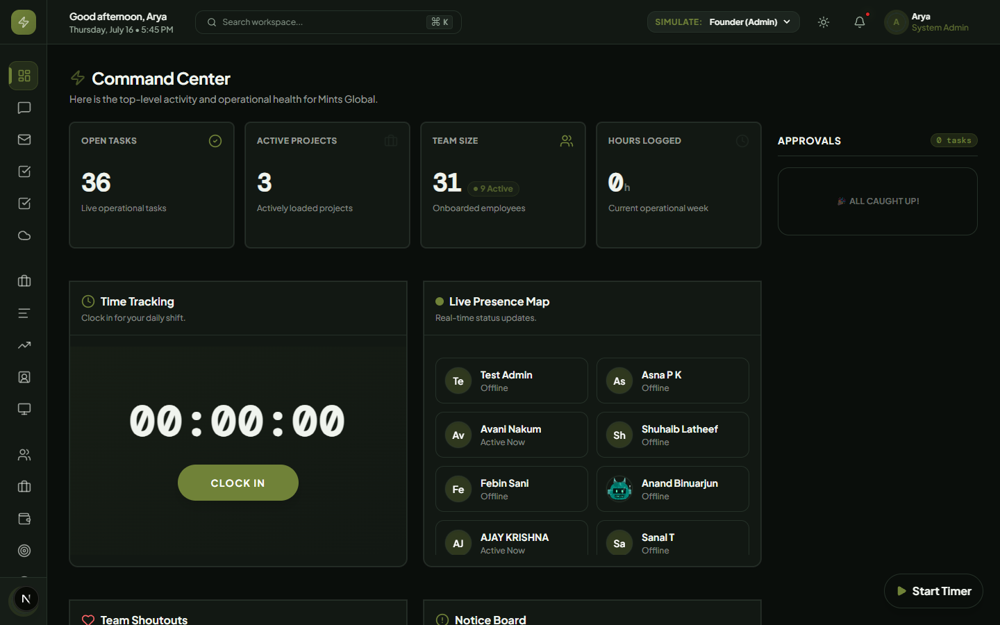
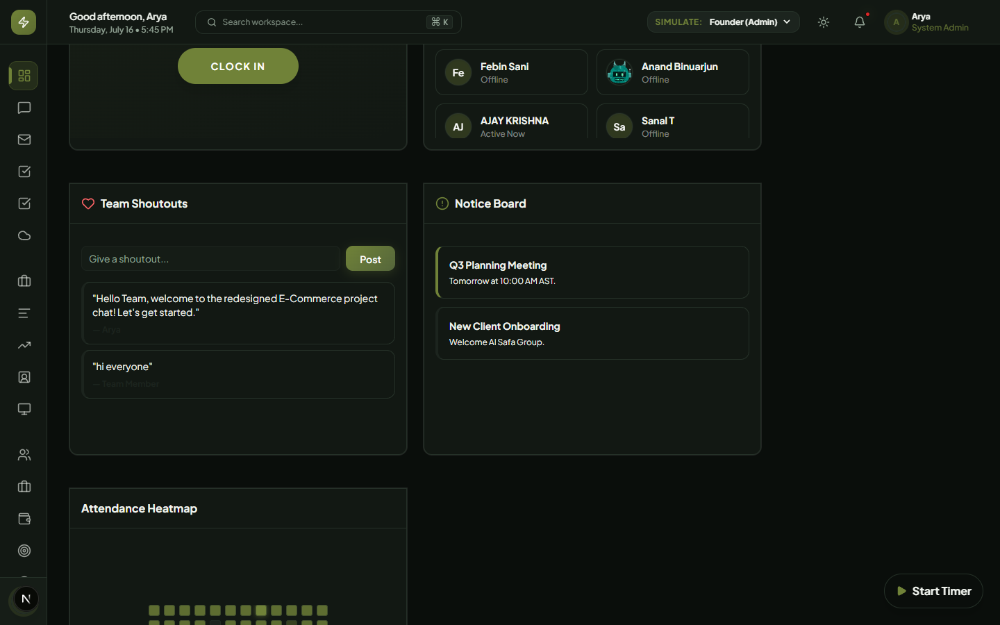
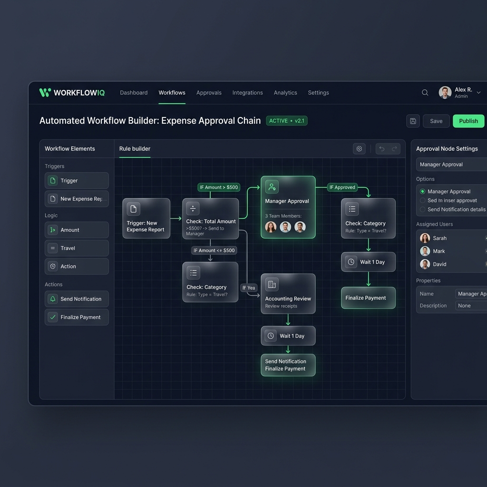
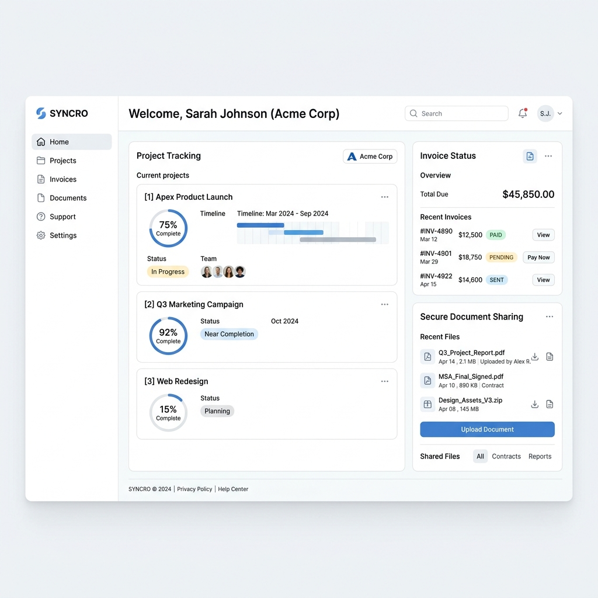
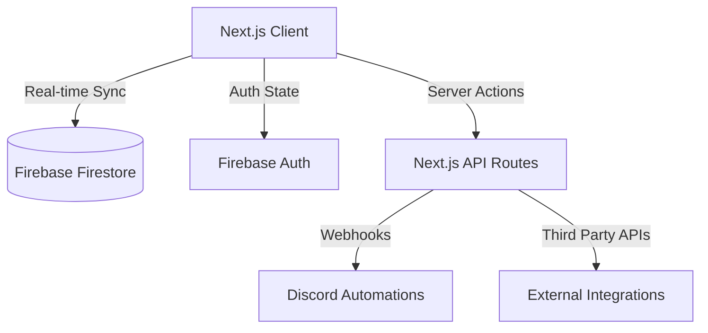

# 🏢 Mints Global ERP | Premium Command Center

Welcome to the **Mints Global ERP**, a state-of-the-art enterprise resource planning system designed to centralize and automate core business operations. Built with modern web technologies, this platform offers a sleek, high-performance interface for Human Resources, Client Relationship Management (CRM), Project Management, Financial Tracking, and Automated Workflows.


## 📸 Interface Preview

<div align="center">
  
  &nbsp;
  
</div>

<br/>

<div align="center">
  
  &nbsp;
  
</div>

<br/>

<div align="center">
  
  &nbsp;
  
</div>

<br/>

<div align="center">
  
  &nbsp;
  
</div>

<div align="center">
  
  &nbsp;
  
</div>

---

## ✨ Recent Feature Updates

The ERP has been recently upgraded with the following powerful modules and enhancements:

- **Automated Workflow Builder**: Create powerful, multi-stage approval chains conditionally triggered by rules (e.g. expenses > $500 route to Founder). Features a gorgeous visual builder.
- **External Client Portal**: A secure, stripped-down view restricted explicitly to external clients. Automatically scopes invoices and project tracking to the logged-in client using secure server-side verification.
- **Approvals Dashboard Widget**: Internal dashboard widget that notifies employees of pending tasks requiring their specific approval.
- **Unified Global Search (Command Palette)**: Press `Cmd/Ctrl + K` to instantly search and navigate across Employees, Projects, Clients, and Chat Channels from anywhere in the app.
- **Interactive Organization Chart (HR)**: Added a visual, multi-level hierarchical tree-view in the HR Directory showing Founder -> Core Team -> Departments.
- **Internal IT & Helpdesk Ticketing**: Created a full Kanban-style module for submitting, assigning, and tracking internal IT and HR support tickets.
- **Admin Audit Trail**: Implemented secure background activity logs to track sensitive user actions for absolute administrative oversight.
- **Time Tracking & Attendance**: Integrated a live Clock-In/Clock-Out widget on the main dashboard, syncing directly to Firebase attendance logs and HR reporting.
- **Interactive Gantt Charts (Timeline View)**: Upgraded project task lists with a toggle to view tasks on a visual timeline (Gantt Chart), mapped across a 7-day calendar view for flawless dependency tracking.

---

## 🏛️ Architecture & Flow Diagram

Mints Global ERP utilizes a secure, serverless architecture powered by Next.js and Firebase. The client communicates directly with Firestore for real-time data sync using a customized React Context provider for Authentication and state management. Server-side API routes handle secure third-party integrations, such as Discord Webhooks.



---

## 💻 Tech Stack

The Mints Global ERP is built on a modern, robust foundation to ensure performance and scalability:

- **Frontend**: Next.js 14 (App Router) + React 19 + TypeScript
- **Backend/DB**: Firebase (Cloud Firestore + Authentication)
- **Styling**: Tailwind CSS v4, Framer Motion, shadcn/ui (Radix UI)
- **Hosting**: Vercel
- **Other integrations**: Discord Webhooks API, Google Workspace (for SSO), jsPDF (for document generation)

---

## 🚀 Getting Started

This section is critical for setting up the local development environment for onboarding developers.

### Prerequisites

- **Node.js** (v18.x or higher)
- **npm** or **yarn**
- **Firebase Project** setup (Firestore, Authentication enabled)
- **Discord Server** (with Webhook integrations enabled)

### Clone the repo

```bash
git clone https://github.com/Mints-ai/ERP.git
cd ERP
```

### Install dependencies

```bash
npm install
```

### Environment variables

Create a `.env.local` file in the root directory. You must include the following keys (do not reveal actual values in source control):

```env
NEXT_PUBLIC_FIREBASE_API_KEY=""
NEXT_PUBLIC_FIREBASE_AUTH_DOMAIN=""
NEXT_PUBLIC_FIREBASE_PROJECT_ID=""
NEXT_PUBLIC_FIREBASE_STORAGE_BUCKET=""
NEXT_PUBLIC_FIREBASE_MESSAGING_SENDER_ID=""
NEXT_PUBLIC_FIREBASE_APP_ID=""
DISCORD_WEBHOOK_URL=""
```

### Discord Webhook Configuration

To prevent HTTP 400 (`Cannot send an empty message`) errors when connecting GitHub or custom alerts to Discord:

1. Generate a webhook in Discord (Server Settings -> Integrations -> Webhooks).
2. Append `/github` to the end of the URL before saving it in your `.env.local` or GitHub settings.
   - **Example:** `https://discord.com/api/webhooks/123/abc/github`

### Run locally

```bash
npm run dev
```

The application will start at `http://localhost:3000`.

---

## 📂 Project Structure

```text
/
├── public/                 # Static assets, brand logos
├── src/
│   ├── app/                # Next.js App Router pages (Dashboard, Login, API)
│   │   ├── api/            # Serverless API routes (Discord, OCR)
│   │   ├── dashboard/      # All ERP modules (HR, Finance, Projects, CRM, etc.)
│   │   └── login/          # Authentication entry point
│   ├── components/         # Reusable UI components
│   │   ├── layout/         # Navigation, Sidebar, RoleGuard, TopNav
│   │   └── ui/             # shadcn/ui generic components
│   ├── context/            # React Context (AuthContext, ToastContext)
│   └── lib/                # Utility functions, Firebase init, Permissions
├── .env.local              # Environment variables (git-ignored)
└── tailwind.config.ts      # Tailwind CSS configuration
```

---

## 🗄️ Database Architecture

The application uses Firebase Firestore as a NoSQL document database. Key collections include:

- `users`: Stores employee profiles, roles, departments, and static auth emails.
- `attendance`: Records daily check-in/check-out timestamps linked to employee IDs.
- `leaves`: Tracks leave requests, date ranges, types, and manager approval statuses.
- `projects`: Contains active project scopes, team member arrays, and deadlines.
- `clients`: Official client roster converted from the CRM pipeline.
- `settings`: Global configuration documents (e.g., HQ address for finance invoices).

---

## 🌍 Production Deployment

The ERP is optimized for Vercel. To deploy to production:

1. Push your latest code to the `master` branch on GitHub.
2. Log into [Vercel](https://vercel.com) and import the GitHub repository.
3. In the Vercel project settings, navigate to **Environment Variables** and paste all your `.env.local` keys.
4. Click **Deploy**. Vercel will automatically compile the Next.js app and assign a live production URL.

---

## ✨ Features

Mints Global ERP replaces disjointed spreadsheets and isolated SaaS tools by bringing everything under one unified roof.

### Modules currently built

- **Attendance tracking**: Real-time logging with geolocated location telemetry and check-in logs.
- **Real-time Live Presence Map**: Pulsing status markers display online, idle, and offline team members inside the Command Center using live Firestore heartbeats.
- **Employee management (HR Hub)**: Onboard new hires, modify clearance roles, track multi-department assignments, and assign specialized corporate subrole service badges with auto-wrapping details drawer and card overflow limits.
- **Corporate Chat & collaborations**: Real-time P2P secure direct messaging, custom group chats, self-healing deduplicated department rooms (Engineering, Marketing, Information Technology, Operations), and dynamic admin member assignment dialogs.
- **Leave management**: Apply for leaves, manage global absences calendar, and approval console.
- **CRM & Sales Pipeline**: Visual Kanban pipeline for leads and official Client list conversion.
- **Projects, Gantt Timelines & Timesheets**: Milestone charts, Gantt relative timelines, workload capacity planner heatmaps, and weekly spreadsheet-style timesheet grids.
- **Secure Company Drive & Assets Explorer**: Subdirectories, Dynamic global search/tags, Founding Director folder locking (RBAC), and direct client publication.
- **Executive Control Panel**: Dynamic settings Discord webhook toggles (Auth, Financial, HR), connectivity testing routes, and Auditor CSV logs exporter.
- **Role-based access control (RBAC)**: Secure access gating based on hierarchy (Founders, C-Suite, Managers, Employees, Interns).
- **Discord Bot Integration**: Real-time notifications filtered dynamically by custom triggers.
- **Global Command Palette**: Instantly search and navigate across the ERP (`Ctrl+K`).

---

## 🤝 Contributing Guidelines

Since this is an internal project with interns and team members, please adhere to the following workflow:

### Branch naming convention

Use standard prefixes for branch names: `type/module-name`
Examples:

- `feature/attendance-system`
- `fix/login-button`
- `docs/update-readme`

### Commit message format

We use semantic commit messages:

- `feat: add new reporting dashboard`
- `fix: resolve responsive layout on mobile`
- `chore: update dependencies`

### PR review process

1. Ensure your code builds locally (`npm run build`).
2. Open a Pull Request targeting the `master` branch.
3. Add a clear description of the changes.
4. Request a review from at least one senior developer or admin.
5. Once approved, the PR can be merged and deployed automatically via Vercel.

---

## 🗺️ Roadmap

We follow a phased development approach:

- **Phase 1: Foundation & HR (Done)**
  - User Authentication, RBAC, HR Hub, Attendance Tracking, Basic Discord Integrations.
- **Phase 2: Operations & CRM (Done)**
  - CRM Pipelines, Projects Module, Leave Management, Team Calendar, Global Base Migration.
- **Phase 3: Advanced Integrations & Automations (In Progress)**
  - Financial tracking, Invoicing, OCR features, Advanced Analytics & Reporting.
- **Phase 4: Client Portal (Upcoming)**
  - Dedicated access for external clients to view project progress and invoices.

---

## 📜 License

**All rights reserved.**
This is a proprietary internal system and is **not open source**. All intellectual property and code rights belong to **Mints Global** (<https://mintsglobal.tech/>). Unauthorized copying, distribution, or usage of this codebase is strictly prohibited.

---
<br/>

# 📖 User Manual

This comprehensive ERP user manual serves users of all roles — from interns to admins — covering everything from first login to advanced workflows.

### 1. Introduction

- **Purpose**: Mints Global ERP is a centralized command center to automate core business operations, replacing disjointed spreadsheets.
- **Scope**: This manual covers HR, Attendance, Leaves, CRM, Projects, and Finance.
- **Audience**: Admin, Manager, Employee, and Intern.
- **Navigation Tips**: Use the sidebar for main modules, and the Command Palette (`Ctrl+K`) for quick actions.

### 2. System Overview

- **High-level overview**: A unified platform to manage staff, sales, projects, and finances.
- **System architecture**: React-based frontend directly querying Firebase Firestore, secured by Role-Based Access Control.
- **Supported browsers**: Modern browsers (Chrome, Edge, Firefox, Safari).
- **System requirements**: Stable internet connection, desktop recommended for complex tables and CRM Kanban.

### 3. Getting Started

- **Access**: Navigate to `http://localhost:3000` (or production URL).
- **Log in**: Use your Google Workspace Account or the internal static email (`username@mintsglobal.ae`) with a temporary password provided by HR.
- **First-time login steps**: Verify your profile details in Settings.
- **Dashboard Overview**: After login, you'll see a unified view of your department's key metrics.

### 4. Comprehensive Role-Based Capabilities

Mints Global ERP enforces strict Role-Based Access Control (RBAC). Here is a detailed breakdown of what each role can accomplish within the platform:

#### 🟢 Interns & Employees

**The core workforce. Access is limited to personal data and assigned tasks.**

- **Dashboard**: View personal quick stats, recent announcements, and upcoming company holidays.
- **Attendance**: Check-in and check-out daily. View personal historical attendance logs and total hours worked.
- **Leaves**: Apply for sick, casual, or annual leave. Check remaining leave balances and view personal leave history and approval status.
- **Projects**: View projects they are explicitly assigned to.
- **Settings**: Update personal profile information and change passwords.

#### 🔵 Managers

**Department leaders. Access includes operational oversight but excludes sensitive financials and HR configurations.**

- **Everything Employees can do**, plus:
- **Attendance**: View attendance logs for all employees within their assigned department(s).
- **Leaves**: Review, approve, or reject leave requests from their department staff. Access the global Team Calendar to foresee capacity shortages.
- **Projects**: Create new projects, assign team members, and monitor the "Capacity Planning" tab to balance workloads across the team.
- **Reports**: Generate and export operational reports (e.g., Attendance and Leave metrics) for their department.

#### 🔴 Founders & Admins (C-Suite)

**Executive control. Unrestricted access to all modules, sensitive data, and system configurations.**

- **Everything Managers can do**, plus:
- **HR Hub (Full Access)**:
  - Onboard new employees and auto-generate credentials.
  - Terminate or suspend employee accounts.
  - Reassign roles and change department allocations.
- **CRM (Client Relationship Management)**:
  - Add, edit, and move leads through the Kanban sales pipeline.
  - Convert won leads into official Clients in the database.
- **Finance**:
  - View overarching company revenue and expense analytics.
  - Generate, download, and manage professional PDF invoices and proposals.
- **Settings & Config**: Edit global company settings (like HQ address used on invoices).

### 5. Module-by-Module Workflows

- **Attendance**: Go to **Attendance**. Use the primary button to **Check In** at the start of your shift, and **Check Out** when finished. Your daily hours are automatically calculated and pushed to the Discord tracking channel.
- **Leave Management**: Go to **Leaves**. Click **Apply for Leave**, select the date range, and specify the type. This immediately notifies Managers in Discord. Managers can click the **Approve/Reject** buttons directly in the Leaves table.
- **Employee Onboarding & Subrole Assignment (Admin Only)**: Go to **HR Hub** -> **+ Add Employee** or click **Edit Profile** on any user page. Fill in their details and assign their primary departments. A dynamic list of checkable subroles matching Mints Global service disciplines (e.g., *Incident response*, *WooCommerce*) will instantly reveal. Checking them will save to their Firestore profile document and render as premium indigo pills featuring a `Sparkles` micro-icon.
- **Corporate Chat & Collaborations (All Roles)**: Go to **Chat**. Launch direct private messages or create custom group conversations. Access pre-seeded channels for **Marketing**, **Information Technology**, and **Operations** which feature self-healing deduplication logic. Admins can click **Manage Members** inside these rooms to dynamically assign new team members.
- **Project Capacity & Timesheet Spreadsheet (Managers/Admins/Employees)**: Navigate to **Projects** -> **Capacity** tab. Check the heatmap to verify task load allocations. To log hours, select the **Timesheet Matrix** tab, click **+ Add Project Row**, select projects, type hours dynamically across daily input cells, and click **Submit Weekly Timesheet** to store the spreadsheet log inside Firestore.
- **Secure File Drive Uploads & Permissions (Admins/Managers/Interns)**: Go to **Files**. Create directories, type dynamic search tokens, or click tags to filter private assets. Restrict sensitive payload assets by creating a `founding-directors-only` directory to lock access from employee or intern clearances.
- **CRM Pipeline (Admins Only)**: Navigate to **CRM**. Click **+ Add Lead**. As negotiations progress, drag and drop the lead card across stages ("Pitch" -> "Negotiation" -> "Won").
- **Invoicing & Handover (Admins Only)**: Navigate to **Finance**. Click **Create Invoice**, fill in the line items and client details, and click **Download PDF**. The browser dynamically generates a branded invoice using your Global HQ settings. Export deliverables by uploading finalized items inside the Client Handover Vault to make them visible to the Client Portal interface.
- **Integrations & Testing (Admins/Founders)**: Navigate to **Settings** -> **Integrations**. Set your target webhook address, toggle notification event routing (Auth, Finance, HR), click **Test Webhook Connection** to send dynamic instant alerts to Discord, or click **Export Audit Logs** to download the CSV spreadsheets.

### 6. Navigation Guide

- **Sidebar**: Primary navigation on the left.
- **Switching Modules**: Click any item in the sidebar.
- **Search & Filter**: Use the top-right search bars on tables to filter records.
- **Command Palette**: Press `Ctrl+K` to search the entire application instantly.

### 7. Forms & Data Entry

- **Filling forms**: Required fields are marked with asterisks. Ensure emails are formatted correctly.
- **Errors**: Red text indicates validation failures.
- **Editing**: Click the edit (pencil) icon on any table row to modify data.
- **Deletion**: Requires confirmation to prevent accidental data loss.

### 8. Notifications & Alerts

- **Triggers**: Leave applications, approvals, daily attendance, and new employee onboarding.
- **Where they appear**: Directly in the corporate Discord server via Webhooks.

### 9. Reports & Analytics

- **Generating Reports**: Go to **Reports** to view company-wide analytics.
- **Filters**: Filter by date range and department.
- **Exporting**: Click **Download PDF** on relevant pages (like Finance invoices) to export data.

### 10. Troubleshooting & FAQs

- **Can't log in**: Check your credentials, ensure Caps Lock is off, or contact your HR Admin to reset your temporary password.
- **Data not saving**: Check your internet connection or look for red validation errors in the form.
- **Permission denied**: Your role doesn't have access to this page. Contact an Admin if you need access.
- **Page not loading**: Hard refresh (`Ctrl+F5`) or clear your browser cache.

### 11. Glossary

- **ERP**: Enterprise Resource Planning.
- **RBAC**: Role-Based Access Control.
- **Firebase**: The backend database and authentication provider.
- **Leave balance**: The number of paid days off you have remaining for the year.
- **Pipeline**: The visual board in CRM representing the sales journey of a client.

### 12. Contact & Support

- **Technical Issues**: Contact the Dev Team or Admin via the internal Discord `#support` channel.
- **Feature Requests**: Drop a message in the `#dev-requests` channel.

### 13. Version History

| Version | Date | Status | Changes |
| :--- | :--- | :--- | :--- |
| **v1.0** | May 2026 | Released | Initial release (Core HR Directory, Attendance Location Logs, Lead CRM Hub) |
| **v1.1** | May 2026 | Released | Leave Planner workflow, Multi-department employee database structures, Static Webhooks |
| **v1.2** | May 2026 | Released | Complete Client Billing Suite, Secure File Explorer Drive (RBAC), Gantt Capacity Heatmap, dynamic Weekly Timesheet matrix spreadsheet, Live Presence Map, and custom Discord settings telemetry center. |
| **v1.3** | May 2026 | **Active Production** | Implemented dynamic department-based specialization subroles, multi-card badge limits (with dynamic overflow +N counts), self-healing deduplicated department chat rooms (Marketing, IT, Operations), and admin add-member action routing controls. |
