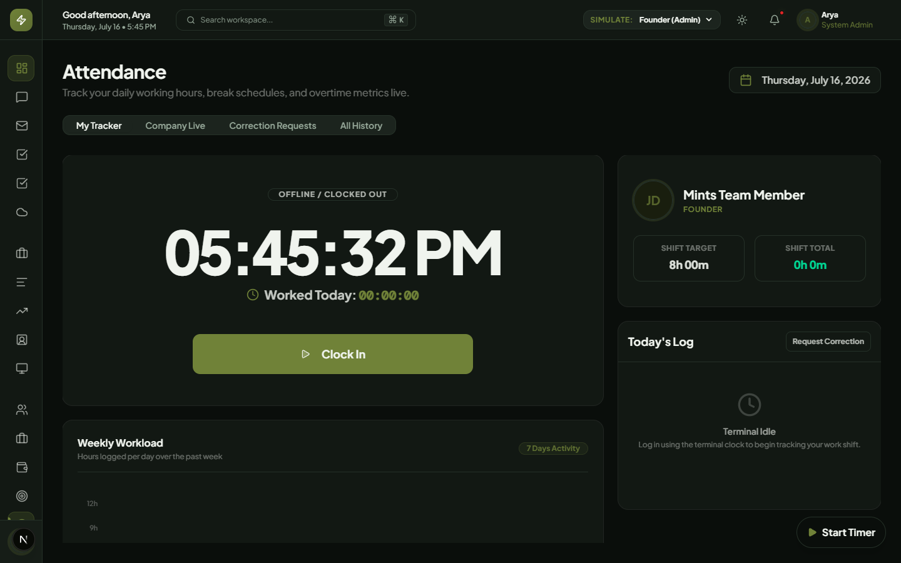
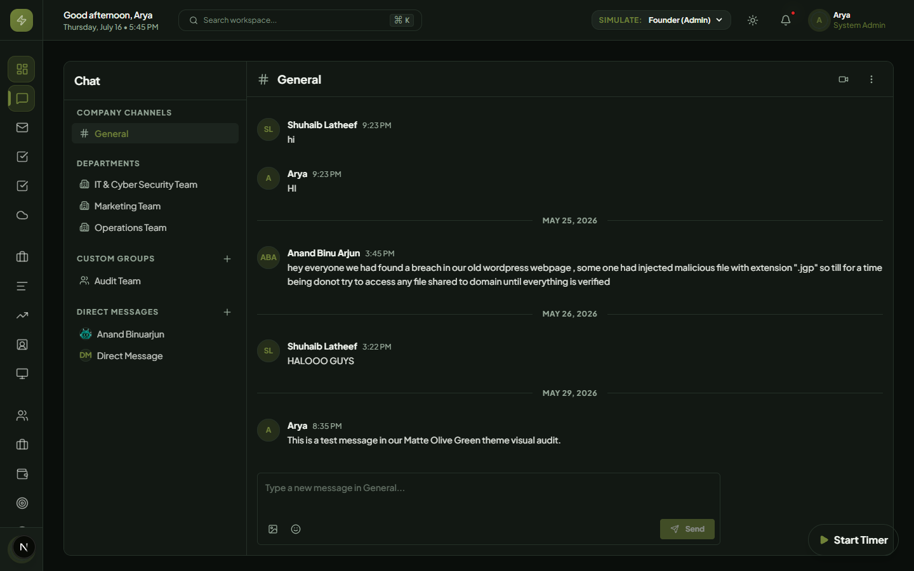
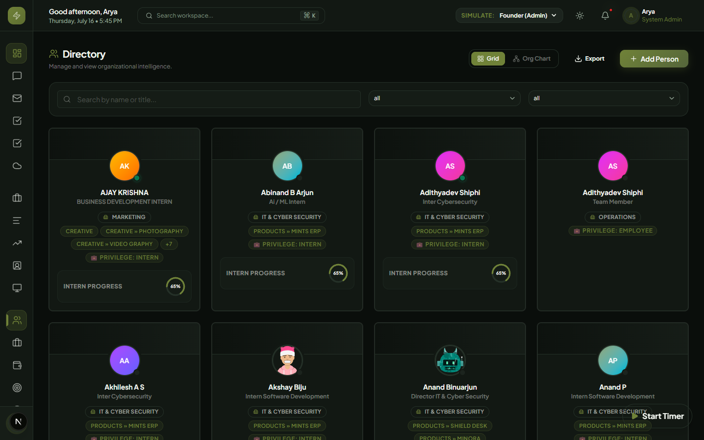
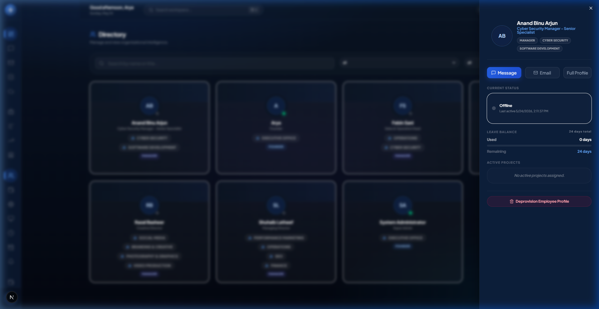
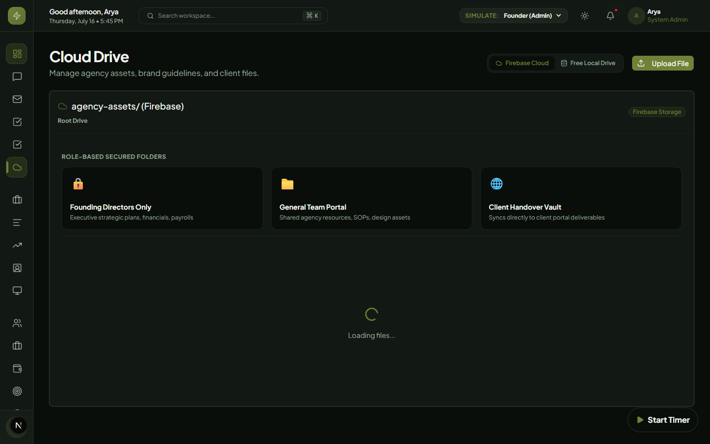
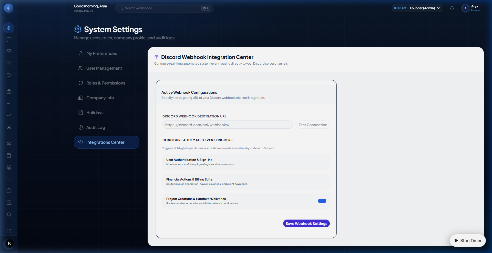

# Mints Global ERP - Enterprise Master User Manual

Welcome to the official **Master User Manual** for the **Mints Global ERP**. This comprehensive reference guide provides end-to-end operational instructions for all fifteen integrated modules within our premium enterprise command center.

---

## 🛠️ Global Role-Based Permissions Matrix

The ERP features dynamic, automated role enforcement to maintain absolute operational safety across all functional areas:

| Module / Feature | Employee (Standard) | Manager | Admin | Founder (Owner) |
| :--- | :---: | :---: | :---: | :---: |
| **Secure Mail Room** | View / Send / Star | View / Send / Star | View / Send / Star | View / Send / Star |
| **Audit Activity Logs**| Read Own | Read Own | Read All / Track | Read All / Track |
| **CRM Leads** | View / Update Deal | Add Leads / Delete | Add Leads / Delete | Add Leads / Delete |
| **Project Lifecycles** | View / Add Tasks | Add Milestones / Edit | Add Milestones / Edit | Full Access / Delete |
| **Finance Treasury** | View Budgets | Add Transactions | Full Access / Invoice | Full Access / Invoice |
| **HR Directory** | View Contacts | View Directory | Edit Profile / Roles | Edit Profile / Roles |
| **Leaves & Time Off** | Submit Requests | Approve Department | Approve Global | Approve Global |
| **Attendance Punch** | Check In & Out | View Reports | Edit Logs | Edit Logs |
| **System Settings** | View Settings | Read Settings | Change Currency | Change Currency |

---

## 🆕 Recent Feature Additions & Enhancements

As part of our continuous ERP upgrades, several new integrated modules have been released:

- **Command Palette (`Cmd/Ctrl + K`)**: Instantly jump across modules, employees, projects, or chats from any screen.
- **HR Interactive Organization Chart**: The HR directory now features a tree-view visualizing the corporate hierarchy (Founder ➔ Core Team ➔ Departments).
- **Internal Ticketing System**: A centralized Kanban board for logging and tracking internal IT/HR/Operations support tickets.
- **Admin Audit Trail Logs**: Automated background activity tracking giving administrators complete visibility over sensitive system events.
- **Live Attendance Widget**: A robust dashboard Clock-In/Out tracker that logs daily operational hours directly into the HR attendance module.
- **Project Gantt Charts**: A visual Timeline mode added to the Project Tasks view, allowing managers to effortlessly track multi-day task dependencies.
- **Automated Workflow Builder**: Dynamic rules engine to conditionally route tasks (like expenses) to specific roles for sequential approval chains.
- **External Client Portal**: A secure, isolated environment explicitly restricted for clients to track their own projects and invoices safely.

---

## 📬 Module 1: Secure Internal Mail Room

The secure internal communication suite provides end-to-end internal memo exchanges, real-time counters, document attachments, and interactive priority filtering.

### 1. Navigating the Mail Dashboard

* Access the mail room via the **Mail** icon in the main left sidebar navigation.
* The dashboard is divided into three responsive columns:
    1. **Left Sidebar:** Compose action button and dynamic folder navigation.
    2. **Middle List Pane:** Real-time searchable list of corporate internal memos.
    3. **Right Detail Pane:** Content inspector and secure action panel.

### 2. Composing Memos with Recipient Autocomplete

To author a new secure memo:

1. Click **Compose Mail** at the top of the mail navigation sidebar.
2. In the **Secure Recipient** input field, start typing the name or email of any corporate employee.
3. The live search dropdown will filter matching employees. Click on a matching result.
4. Once selected, a verified recipient profile card will lock in. Click **Change** to select a different user.
5. Specify the **Subject**, select a **Priority level** (Urgent, Normal, Low), and write your secure message details.
6. Click **Send Memo** to securely deliver the message.

### 3. Attaching Vault Documents

You can securely link corporate vault folders, spreadsheets, or items to your memo during composition:

1. In the **Secure Document Attachments** section of the composition dialog, type a descriptive **Doc Name** (e.g., *Q3 Financial Sheet*).
2. Input the corresponding vault URL or file path.
3. Click **Add**. The attachment tag will render inline (e.g., `📄 Q3 Financial Sheet ×`).
4. You can attach multiple document links. Click `×` next to any tag to remove it.
5. Sent attachments will render as premium click-to-open asset cards in the recipient's preview panel.

### 4. Smart Priority Pills & Search

* Use the **Search Bar** in the middle list pane to find memos by subject line.
* Directly under the search bar, click on **All**, **Urgent**, **Normal**, or **Low** pills to filter memos instantly. Urgent filters will render high-contrast rose colored alerts.

### 5. Managing Starred & Trash Memos

* **Starring:** Click the **Star** icon on any mail list card or inside the detail header to star a memo. The folder badge updates instantly.
* **Trash & Purges:** Click **Delete** to move a memo to the Trash folder.
* **Permanent Purging:** Navigate to the **Trash** folder and click **Purge Permanently** to wipe the memo from the database entirely.

---

## 📁 Module 2: Project Lifecycle, Gantt Charts & Timesheets

The project details and capacity workspace features interactive progress tracking, Gantt timelines, resource workloads, and dynamic weekly timesheet logging.

### 1. Interactive Gantt Timeline
* Track key delivery phases and milestones dynamically on a timeline visualizer.
* Renders calculated horizontal offset bars based on project start and end dates relative to the active timeline bounds, showing inline progress ratios dynamically.

### 2. Resource Capacity Heatmap
* Access the **Resource Capacity Heatmap** via `/dashboard/projects/capacity`.
* Compares assigned task loads and active estimated hours against a standard weekly limit of **40 hours** to visually flag over-allocated employees (Red for >85% Overbooked, Green for Healthy, Indigo for Available bandwidth).

### 3. Unified Weekly Timesheet Matrix Spreadsheet
* Click the **Timesheet Matrix** tab to log weekly operational hours across clients and projects:
  1. Select the relevant employee contact and target active week.
  2. Click **+ Add Project Row** to add client projects to the matrix.
  3. Enter hours worked across daily columns (Monday through Sunday). Row and daily column totals will calculate dynamically as you type.
  4. Click **Submit Weekly Timesheet** to safely commit hours to the Firestore database for executive approval.

### 4. Visual Verification (Timesheet Matrix)

### 5. Interactive Milestones Builder
* **Toggling Completion:** Check/uncheck the circular radio button next to any milestone inside the **Overview** tab.
* **Adding Milestones:** Fill out the title and select an optional target completion date in the form, then click **Add Milestone**.
* **Deleting Milestones:** Authorized managers can delete redundant phases by clicking the delete options next to the milestone items.

### 6. Real-Time Project Health Ring
* The circular progress ring automatically recalculates project status based on completed milestones.
* Every checkbox toggle immediately re-animates the radial ring and calculates the new percentage to keep all stakeholders aligned in real-time.

### 7. Integrated Project Task Linker
Create sprint tasks directly connected to the project:
1. Navigate to the **Tasks** tab inside the project detail dashboard.
2. Add task titles, set priority rankings, and submit to attach them automatically to the active project ID.
3. Tasks will sync instantly with the global kanban board.

### 8. Global Stage Dropdown & Roles Gating

* Managers can transition projects through their lifecycles by changing the status dropdown selector (e.g., **Pitch**, **Active**, **On Hold**, **Completed**, **Cancelled**).
* **Roles Gating:**
  * **All Assigned Members:** Can view the overview, milestones, linked tasks, and files.
  * **Founders & Admins:** Have exclusive rights to add/remove members, update global project stages, add/remove milestones, and permanently delete projects.

---

## 💬 Module 3: Corporate Chat & Collaborations

The corporate chat system provides continuous, real-time messaging, split into three specific categories:

1. **P2P Direct Messaging:** Click on any employee name in the side panel to start a secure 1-on-1 text conversation.
2. **Custom Group Channels:** Create multi-member threads for custom projects or cross-functional groups by clicking **New Group**.
3. **Department Channels:** Built-in dedicated rooms automatically mapping employees based on their system directory profiles, including pre-provisioned channels for **Marketing**, **Information Technology**, and **Operations**.

### 1. Robust Deduplication & Self-Healing Sidebar
* The chat engine features database-level self-healing filters that automatically purge duplicate channel documents in real-time.
* A frontend `seenDepts` deduplicator ensures that the left channel pane remains perfectly clean and uncluttered.

### 2. Administrative Member Assignment
* **Admin Management Console:** Authorized Admins and Founders see a **Manage Members** action button inside department channels.
* **Adding Users:** Click **Manage Members**, select any registered employee from the live system directory in the dialog, and assign them directly to the conversation channel.

### 3. Visual Verification (Chat Suite)

---

## 📊 Module 4: CRM Leads Kanban Board

The CRM (Customer Relationship Management) pipeline manages customer acquisitions:

* **Lead Columns:** Track opportunities through stages: *New*, *Contacted*, *Proposal Sent*, *Negotiation*, *Closed Won*, *Closed Lost*.
* **Lead Cards:** Details include client name, deal value ($), priority level, and assigned sales lead.
* **Drag & Drop:** Move deal cards across columns to update pipeline statistics instantly.
* **Pipeline Metrics:** Visual aggregates at the top display total pipeline value, average deal size, and sales conversion rates.

---

## 💼 Module 5: Clients & CRM Profiles

Maintain structural business directories for active clients:

* **Client Profiles:** Record primary corporate contacts, emails, phone directories, contract values, and historical engagement details.
* **Active Project Linking:** Bind active software/consulting projects to client records to track billing cycles and milestones directly.

---

## 📈 Module 6: Tasks & Sprint Kanban Board

A centralized task manager driving corporate sprints:

* **Kanban Workflow:** Manage items through *Backlog*, *To Do*, *In Progress*, and *Done* cards.
* **Interactive Modals:** Click on any card to update descriptions, assignees, priorities, or toggle blockers.
* **Filtering:** Instantly sort task workloads by project, assignee, or priority index.

---

## 💸 Module 7: Finance & Corporate Treasury

Manages invoices, track operating budgets, and monitor cash reserves:

* **Financial Dashboard:** Visually track revenue, overhead costs, and monthly margins with dynamic charts.
* **Invoice Generator:** Create new professional invoices specifying clients, line items, VAT rates, and payment due dates. Exporters enable printing or PDF compilation with a single click.
* **Operating Ledger:** Log company incomes and operational expenses directly into Firestore.

---

## 👥 Module 8: HR Directory & Employee DB

The employee database holds active records:

* **Employee Cards:** View names, job titles, department assignments, specialized subroles, contact numbers, and corporate emails.
* **Role Modifications:** Admins and Founders can promote/demote user clearance levels, edit profile data, reassign department rosters, and change specialized subroles.
* **Granular Specialization Subroles:** Directly assign service subroles mapped to corporate departments (e.g., *Offensive security* or *Cloud Security* under Cyber Security, or *Web Applications* and *ERP* under Software Development).

### 1. Specialization Badge Layouts & Details Drawer
* **Premium Subrole Badges:** Assigned specialties display as sleek, indigo-colored pills featuring a `Sparkles` micro-icon.
* **Adaptive Directory Cards:** Card tags are automatically bounded to a maximum of 3 visible items with a dynamic `+N` overflow indicator. This guarantees that employee grid cards maintain uniform pixel heights.
* **Self-Wrapping Flex Grid:** The Details quick-view drawer applies self-wrapping layout constraints (`flex-wrap` and `whitespace-nowrap`) to prevent text cut-offs on mobile screens or action buttons breaking across multiple lines.

### 2. Visual Verification (HR Directory & Subroles)

  
  &nbsp;
  

---

## 📅 Module 9: Leaves & Time Off Planner

Automates paid time off (PTO) and sick leave management:

* **Leave Requests:** Employees submit requests stating date ranges, leave type (Annual, Sick, Personal, Emergency, Maternity/Paternity), and reasons using a translucent, responsive glass dialog form.
* **Employee Balance Cards:** Frosted, sleek balance cards dynamically track annual leave balances and show remaining, used, and sick leave summaries with glowing indicators.
* **Approval Console:** Managers receive live, highlighted pending logs in their dashboards, and can **Approve** or **Reject** requests with single-click actions styled with custom emerald/rose gradients.
* **Team Leave Calendar:** An elegant, interactive monthly grid detailing all approved leaves. Day cells highlight active employee absences, and a custom blue-glow today indicator anchors current dates.

---

## ⏱️ Module 10: Attendance & Location Timecard

The attendance module tracks daily shift workloads, active presences, and break timelines:

* **Punch In / Out & Break Timer:** A central, glowing glass card displays current worked-today shifts durations, active break schedules, and animated presence tags. Standard terminal buttons allow team members to **Clock In**, **Take Break**, **Resume Work**, or **Clock Out** easily.
* **Unified Tab Routing**: Features streamlined tab controls ("My Tracker", "Company Live", "All History") governed by the centralized, accessible Tab system.
* **Live Presence Grid:** An organizational oversight dashboard mapping live active teams, departments, precise worked-hours (highlighting green **OVERTIME** metrics), and chronological activity logs.
* **Shift Timelines Popup:** Displays a detailed, vertical vertical timeline popup showing exactly when employees clocked in/out or initiated breaks.
* **Audit History logs:** Accessible dashboards detailing historical shift parameters, custom date filter ranges, and detailed activity timelines popover views.

---

## 📢 Module 11: Announcements Hub

The announcements board broadcasts information:

* **Broadcasts:** Send company-wide announcements instantly to the home dashboard.
* **Importance Levels:** Mark news as *Urgent*, *Normal*, or *Update* to apply high-visibility banner warnings.

---

## 📁 Module 12: File Vault & Cloud Storage

The secure corporate repository featuring subdirectory structures, dynamic tags, global search, and granular access control:

* **Subdirectory Navigation:** Traverse folders dynamically using interactive breadcrumb trails.
* **Granular Access (RBAC Folder Lock):** Restricted folders like `founding-directors-only` are dynamically locked behind Founder/C-Suite permissions. Accessing them redirects standard employees or interns to a secure glass padlock warning window.
* **Intern Read-Only Restriction:** Intern accounts are blocked from file deletions or modifications, enforcing strict read-only parameters.
* **Client Handover Publication:** Upload assets directly into Client Handover Vault folders to automatically sync files with the Client Portal invoice and assets screen.

---

## 📊 Module 13: Reports & Intelligence Analytics

Interactive corporate dashboards tracking ERP KPIs:

* **Task Performance:** Charts tracking task completion velocities and team cycle rates.
* **CRM Performance:** Leads conversion analysis, pipeline velocities, and agent performance maps.
* **Treasury Performance:** Monthly revenue margins, net cash flow charts, and cash reserve runway tracking.

---

## ⚙️ Module 14: System Settings

Configure international settings:

* **Currency Switcher:** Toggle the workspace currency between **USD**, **EUR**, **GBP**, **AED**, **INR**, etc. All invoicing and project budgeting tables will adjust automatically.
* **Branding Preferences:** Configure dashboard logos, metadata, and company information templates.

---

## 🛡️ Module 15: Admin Live Telemetry & Integrations

Founder dashboard tracking company security events, real-time active users, and external telemetry tools:

* **Real-time Live Presence Map:** Visible inside the core Command Center, tracks every user's last Firestore activity heartbeat to display:
  - **Online (Active now):** Heartbeat recorded within the last 5 minutes.
  - **Idle:** Heartbeat recorded within the last 15 minutes.
  - **Offline:** Renders last active relative dates and gray indicators.
* **Dynamic Discord Telemetry Router:** In settings, select your Webhook URL destination and configure active event toggles (Authentication, Financial, HR/Leaves) to filter Discord notifications.
* **Auditor CSV Exporter:** Exporters compile and download the full compliance spreadsheet audit logs instantly in CSV format with a single click.

---

## 📅 16. Version History

| Version | Date | Status | Changes |
| :--- | :--- | :--- | :--- |
| **v1.0** | May 2026 | Released | Initial release (Core HR Directory, Attendance Location Logs, Lead CRM Hub) |
| **v1.1** | May 2026 | Released | Leave Planner workflow, Multi-department employee database structures, Static Webhooks |
| **v1.2** | May 2026 | Released | Complete Client Billing Suite, Secure File Explorer Drive (RBAC), Gantt Capacity Heatmap, dynamic Weekly Timesheet matrix spreadsheet, Live Presence Map, and custom Discord settings telemetry center. |
| **v1.3** | May 2026 | Released | Implemented dynamic department-based specialization subroles, multi-card badge limits (with dynamic overflow +N counts), self-healing deduplicated department chat rooms (Marketing, IT, Operations), and admin add-member action routing controls. |
| **v1.4** | May 2026 | **Active Production** | Complete visual restyling of both the Attendance tracker (featuring standard Tabs routing and chronological timelines popups) and the Leave Management dashboard (featuring the team calendar month grid and glassmorphic balances cards), unifying both modules with the modern Sleek Modern Blue Glassmorphic design language. |
